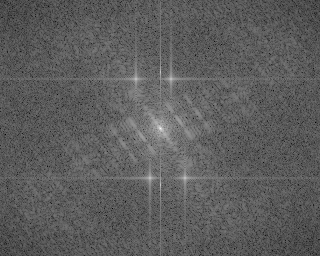
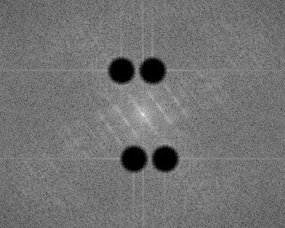
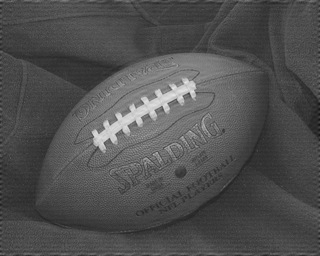

# Filtering in the Frequency Domain

## An example of what results can be achieved by using the frequency domain to filter images.

The original image shows a periodic pattern. Is it possible to filter it out?

Using the Discrete Fourier Transform, the image can be analyzed in the frequency domain. There are four bursts of relatively high frequency standing out from the distribution of frequencies in the Spectrum below, which seem to represent the periodic pattern to be removed.

It is possible to remove these bursts by blacking-out them in the spectrum image, that is, multiplying the desired frequencies by zero.

Using the Inverse Discrete Fourier Transform to get back to the spatial domain, now without the abnormal frequencies, the image is free of most of the periodic pattern it had before.

