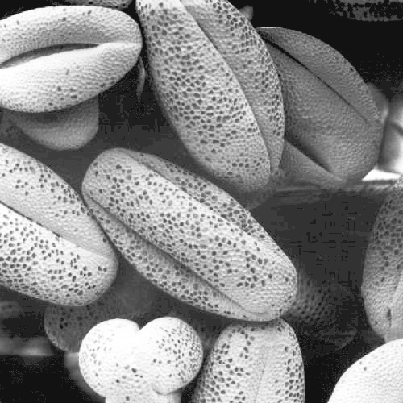

# Histogram Equalization

Histogram analisis:
- In low-contrast images, the intensities are restricted to a small range.
- In dark or bright images, the intensities are concentrated towards the lower or higher end, respectively.
- In high contrast images, the intensities cover a wide range.

Histogram equalization is a technique used to make better use of the intensity scale in an image and, as a consequence, improve the image contrast.

Use a monotonic increase function to map the values from the original image to the equalized one, maintaing the intensity scale. In this exameple, the cumulative probability function of pixel intensities is used.

|  |  |
| :------------------------------------------------: | :----------------------------------------: |
|                    low contrast                    |                    dark                    |

|  |  |
| :--------------------------------------------------------: | :--------------------------------------------------------: |
|                    low contrast result                     |                        dark result                         |