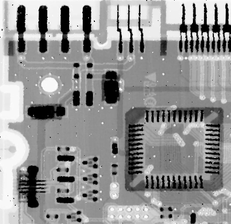

# Median Filter

## An example of when it is useful to use the median filter.

There is salt and pepper impulsive noise in the original image. Using the median filter, it is possible to reduce that noise, since too high or too low values tend to be filtered out.

|  |
| :-------------------------------------------: |
|               *Kernel Size = 3*               |

|  |
| :-------------------------------------------: |
|               *Kernel Size = 5*               |

|  |
| :-------------------------------------------: |
|               *Kernel Size = 7*               |

Notice that larger kernerls result in less noise, but also in a more washed-out look.